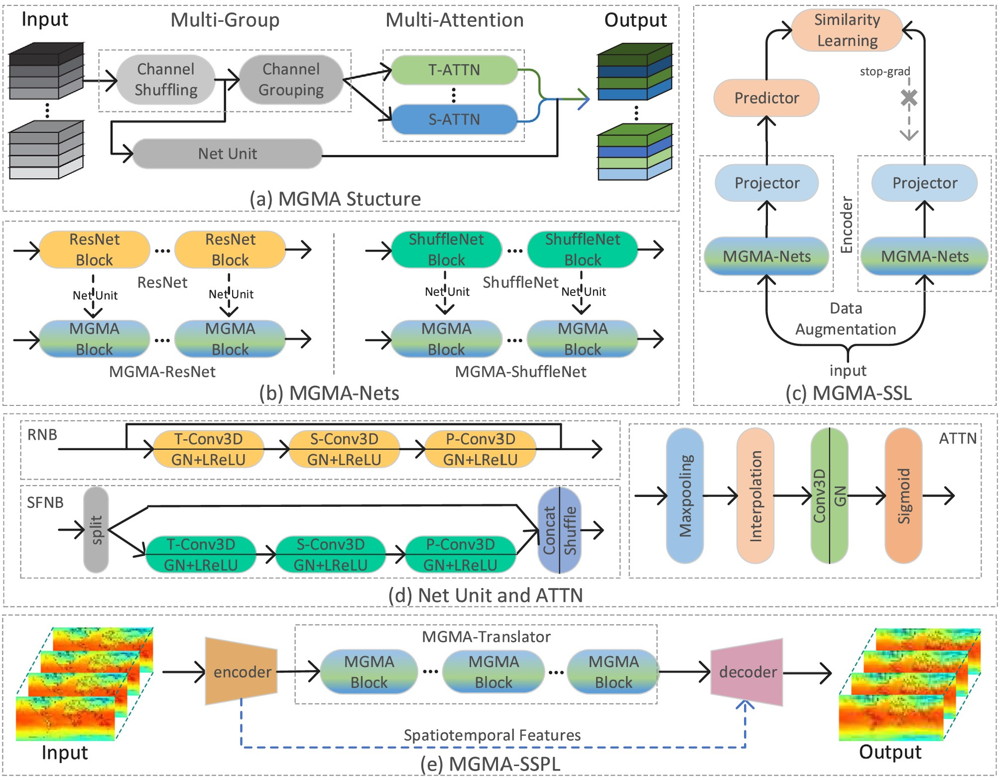

# Spatiotemporal Self-supervised Predictive Learning for Atmospheric Variable Prediction via Multi-Group Multi-Attention

We release the code and models of our paper:

- Spatiotemporal Self-supervised Predictive Learning for Atmospheric Variable Prediction via Multi-Group Multi-Attention. Knowledge-Based Systems, 2024, DOI: [10.1016/j.knosys.2024.112090](https://doi.org/10.1016/j.knosys.2024.112090)

## Overview

The SSPL framework for AVP is essentially a spatiotemporal predictive learning approach. Additionally, we improve a multi-group multi-attention (MGMA) method, integrating it into our predictive framework to enhance spatiotemporal representation learning. The data source is derived from temperature, wind speed, humidity, and more in the EAR5 (ECMWF Reanalysis 5) reanalysis data product from 1979 to 2018.

<div align="center">
   
</div>

In this work, we adopt a common encoder-translator-decoder predictive learning framework which utilizes a consecutive sequence of 2D numerical data (total 3D data) representing atmospheric variables over a specific time step to predict the numerical sequence for the next time step. Our MGMA-based model clearly excels in performance, successfully surpassing the latest SOTA models by integrating the multi-group and multi-attention approach into the network units.

<div align="center">
   
</div>

The contents of this repo are organized as:
* [**Updates**](#updates)
* [**Dataset Download**](#dataset-download)
* [**Preparation**](#preparation)
* [**Getting Started**](#getting-started)
* [**Model Zoo**](#model-zoo)
* [**Visualization**](#visualization)
* [**License**](#license)
* [**Acknowledgement**](#acknowledgement)
* [**Citation**](#citation)

## Updates

- [2024-10-13] The code and models for ST-SSPL-AVP are released.

## Dataset Download

The data used in ST-SSPL-AVP can be downloaded from the [WeatherBench Github Repo](https://github.com/pangeo-data/WeatherBench) for the corresponding datasets of AVP elements and resolutions.

## Preparation
Please refer to the instructions in [PREPARATION.md](docs/PREPARATION.md) for installation and data preparation.

## Getting Started
Please refer to [GETTING_STARTED.md](docs/GETTING_STARTED.md) for running the benchmark method.

## Model Zoo
The models and results are provided in [MODEL_ZOO.md](docs/MODEL_ZOO.md).

## Visualization
The visualization results are provided in [VISUALIZATION.md](docs/VISUALIZATION.md).

## License
The data and code in this repo are released under the [Apache 2.0 license](LICENSE).

## Acknowledgement
Thanks for the works and their contributors of the following codebases and data products.

- [zhenglab/mgma](https://github.com/zhenglab/mgma)
- [chengtan9907/OpenSTL](https://github.com/chengtan9907/OpenSTL)

## Citation

```

@article{shi2024spatiotemporal,
  title={Spatiotemporal self-supervised predictive learning for atmospheric variable prediction via multi-group multi-attention},
  author={Shi, Zhensheng and Zheng, Haiyong and Dong, Junyu},
  journal={Knowledge-Based Systems},
  pages={112090},
  year={2024},
  publisher={Elsevier}
}

@inproceedings{shi2020multi,
  title={Multi-Group Multi-Attention: Towards Discriminative Spatiotemporal Representation},
  author={Shi, Zhensheng and Cao, Liangjie and Guan, Cheng and Liang, Ju and Li, Qianqian and Gu, Zhaorui and Zheng, Haiyong and Zheng, Bing},
  booktitle={Proceedings of the 28th ACM International Conference on Multimedia},
  pages={2057--2066},
  year={2020}
}

```
